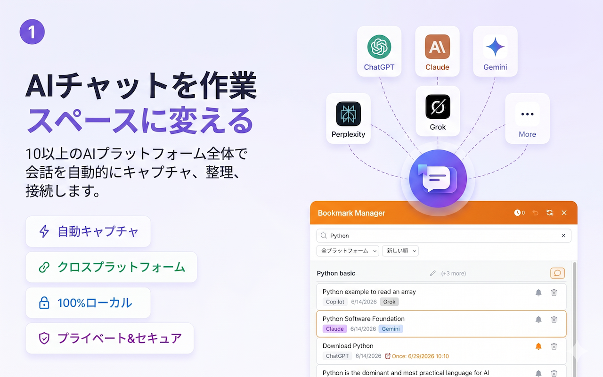
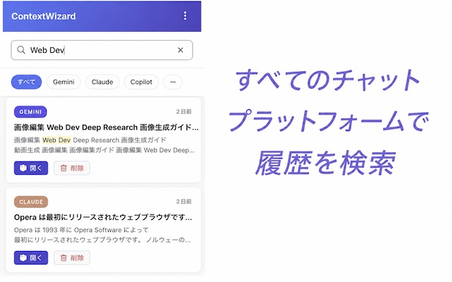
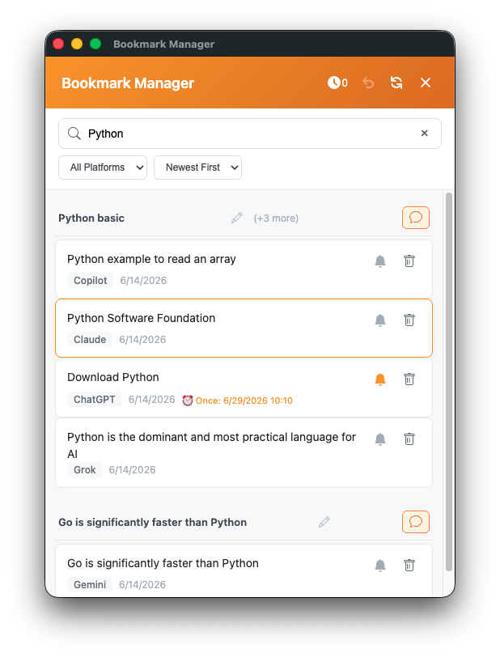

  <a href="README.md">English</a> · <a href="README-zh.md">中文</a> · <a href="README-ja.md">日本語</a>

<picture>
  <source media="(prefers-color-scheme: dark)" srcset="assets/banners/new-banner1-jp.png">
  
</picture>

 

# ContextWizard — AI ワークスペース & チャット検索

**すべての AI アシスタントのためのパーソナルメモリーレイヤー**

---

## 🌟 はじめに

**ContextWizard** は、**ChatGPT、Claude、Gemini、Copilot、Perplexity、Grok、DeepSeek など 10 以上の AI プラットフォーム**で行った会話を自動的にキャプチャ、整理、検索し、再接続する無料のローカルファーストブラウザ拡張です。プロジェクトごとに成長する、統一された検索可能なワークスペースを作成します。

> **AI から得たインサイトを失うのはもうやめましょう。ContextWizard はプラットフォーム間の壁を取り除きます — Claude でのコンテキストは ChatGPT にも持ち運べます。**

| ✅ 自動キャプチャ | ✅ 跨プラットフォーム検索 | ✅ ブックマーク & リマインダー |
|:---:|:---:|:---:|
| ✅ コンテキストパネル v2.0 | ✅ ワークスペース | ✅ 100% ローカル & プライベート |

---

## ✨ 主な機能

### 📸 自動キャプチャ
チャット中に会話が自動的に保存されます。ボタン不要、手動保存不要。拡張はすべての対応プラットフォームでインテリジェントな重複排除により、新しいメッセージをリアルタイムで検出します。

- **自動モード**: すべての会話を継続的に保存
- **ドメインフィルター**: 特定のプラットフォームの含除を制御
- **プラットフォーム固有のアダプター**: 各 AI サービスに正確な抽出
- **ビジュアルインジケーター**: キャプチャ中の状態を表示

### 🔍 強力な跨プラットフォーム検索
**すべてのプラットフォームのキャプチャ済み会話を同時に全文検索**します。

- フレーズ検索 + キーワードマッチング
- 関連性と新しさに基づくスマートランキング
- プラットフォーム、ワークスペース、期間でフィルター
- 上位のコンテキストプレビューで会話の文脈を確認
- マッチタイプインジケーターで結果の理由を表示

> 1 回の検索で ChatGPT、Claude、Gemini、およびすべてのプラットフォームを同時にクエリ。プラットフォームごとの記憶の欠如とはもう縁を切りましょう。

### 🔖 跨プラットフォームブックマーク & グループ
ChatGPT、Claude、Gemini の重要な瞬間を一か所に保存。カスタムグループに整理します。

- **ネストされたブックマークグループ**: 会話 URL ではなく、正確なメッセージにマーカーを付与
- **自動生成タイトル**: グループタイトルは会話内容から自動生成
- **スマートクリーンアップ**: 空のグループは自動削除

### 🧠 コンテキストパネル（v2.0）
**ブックマークコンテキストチャット** — ブックマークしたインサイトが、新しい会話を始めても後ろに残ることはもうありません。

- **フローティングパネル**がチャット入力の横に表示
- ブックマークを選択して、任意の会話に直接インジェクト
- **スマート関連性**: 現在のトピックに関連性の高いブックマークを表示
- **セッション管理**: プロジェクトごとに独立したコンテキストを保持
- キーボードナビゲーション（Tab、矢印キー、Space、Enter、Escape）

### 📂 AI ワークスペース
会話をプロジェクト別に整理します。

- ドラッグ＆ドロップでワークスペース間を移動
- 新しいキャプチャには最近使用したワークスペースが自動選択
- ワークスペースレベルの検索で結果をプロジェクト内に限定
- グループタイトルは会話内容から自動生成

### ⏰ スマートリマインダー
重要なインサイトを二度と失いません。ブックマークしたメッセージにリマインダーを設定します。

- **繰り返し**: 1 回、毎日、平日、毎週、毎月
- **ブラウザ通知**: 最小化時でも確実に通知を表示
- 通知をクリックすると、正確なブックマークメッセージにジャンプ

### ☁️ オプションのクラウドシンク（有料）
複数のコンピュータ間でワークスペースとブックマークを同期します。

- 転送中・保存中の両方でエンドツーエンド暗号化
- Google SSO — サードパーティサービスは不要
- 7 日間無料体験、クレジットカード不要

### ✏️ プロンプトエディター & プライバシーガード
自動エディット機能付きの再利用可能なプロンプトテンプレートを管理します。

- プロンプトの作成、編集、整理
- **自動エディット**: 機密情報（API キー、パスワード、トークン）を自動削除
- カスタムエディットルールの定義

---

## 🖼️ スクリーンショット

| メインダッシュボード | 検索インターフェース | プラットフォーム管理 |
|:---:|:---:|:---:|
|  |  |  |
| キャプチャ済み会話の一覧 | すべてのプラットフォームで全文検索 | プラットフォームのオン/オフ切り替え |

| オプション & データ | ブックマーク |
|:---:|:---:|
|  |  |
| データ管理 & 設定 | 跨プラットフォームブックマークグループ |

---

## 🚀 クイックスタート

1. **インストール**: [Chrome ウェブストア](https://chromewebstore.google.com/detail/contextwizard-%E2%80%93-ai-worksp/lmhnmmedgmnfggecdalkancllnekofnb) または [Edge アドオン](https://microsoftedge.microsoft.com/addons/detail/contextwizard/nknoacgaapoeboehlgelolgbifgcimli) からインストール
2. **ダッシュボードを開く**: ツールバーの ContextWizard アイコンをクリック
3. **プラットフォームを選択**: キャプチャしたいプラットフォームを切り替え（デフォルトはすべてオン）
4. **チャット開始**: 対応する AI プラットフォームにアクセス — キャプチャが自動的に開始
5. **検索 & 整理**: 会話を検索、ブックマーク、整理

> アカウント不要。API キー不要。設定ファイル不要。インストールしてすぐ使えます。

### ビデオデモ
- [製品全体デモ](https://youtu.be/4Mz6PAHwSuY)
- [跨プラットフォームブックマークデモ](https://youtu.be/_XzSm3txFkg)
- [ページコンテキストコピーデモ](https://youtu.be/lYbXXWZZMJ0)
- [跨プラットフォームスレッド転送デモ](https://youtu.be/UDKbb1h-NMA)

---

## 🛡️ プライバシー & セキュリティ

**ContextWizard はローカルファースト、ゼロトラストアーキテクチャで構築されています。**

| 項目 | 詳細 |
|------|------|
| **データストレージ** | すべてのデータはブラウザの IndexedDB（`chrome.storage.local`）にローカル保存 |
| **クラウドアップロード** | デフォルトではなし。明示的に有効にした場合のみオプションのクラウドシンク |
| **暗号化** | クシンク使用時はエンドツーエンド暗号化 |
| **トラッキング** | ゼロ。アナリティクス、テレメトリー一切なし |
| **権限** | Manifest V3 の最小限 — AI プラットフォームドメインのみにスコープ |
| **アカウント** | コア機能にアカウントは不要 |

プロンプト、プロプライエタリコード、ビジネスコンテキスト、個人情報は**デフォルトで完全にオフライン**のままです。

> 🔒 [プライバシー & セキュリティの完全なドキュメント →](docs/privacy.md)

---

## 🔧 対応プラットフォーム

| 内蔵 | カスタム |
|------|----------|
| ChatGPT (chatgpt.com) | URL パターンで任意の AI チャットサイトを追加可能 |
| Claude (claude.ai) | |
| Gemini (gemini.google.com) | |
| Microsoft Copilot | |
| Perplexity (perplexity.ai) | |
| HuggingChat (huggingface.co/chat) | |
| Poe (poe.com) | |
| Grok (grok.com) | |
| DeepSeek (chat.deepseek.com) | |
| Qwen (chat.qwen.ai) | |
| Kimi (kimi.com) | |
| Manus (manus.im) | |

[📋 完全なプラットフォームドキュメント →](docs/supported-platforms.md)

---

## 💡 ユースケース

| ロール | ContextWizard がどう役立つか |
|------|------------------------|
| **開発者** | 複数の AI コーディングアシスタントからコードスニペット、デバッグセッション、アーキテクチャ議論をキャプチャ。すべてを即座に検索。 |
| **ライター & マーケーター** | 原稿、修正、ブレインストーミングセッションを保存。タブを切り替えずに ChatGPT と Claude の過去の作業を参照。 |
| **研究者** | 文献レビュー、データ分析、方法論の議論をプロジェクト別ワークスペースに収集。 |
| **学生** | 学習セッション、宿題サポート、科目別の教材を整理。試験復習のリマインダーを設定。 |
| **プロダクトマネージャー** | 競合分析、ユーザー調査、戦略ドキュメントを一か所にアクセス可能に。プラットフォーム間でクロスリファレンス。 |
| **AI パワーユーザー** | 日常の AI インタラクションから永続的なナレッジベースを構築 — プロンプト実験、モデル比較、繰り返しワークフロー。 |

---

## 📊 なぜ ContextWizard か — 代替手段との比較

| 機能 | ContextWizard | ブラウザブックマーク | 手動メモ | プラットフォーム履歴 |
|------|:---:|:---:|:---:|:---:|
| **マルチプラットフォーム** | ✅ 10+ プラットフォーム | ✅（URL のみ） | ✅（手動） | ❌ シロ化 |
| **全文検索** | ✅ サブ秒 | ❌ URL のみ | ❌ | ❌ プラットフォームごと |
| **メッセージレベルのブックマーク** | ✅ | ❌ | ❌ | ❌ |
| **自動キャプチャ** | ✅ | ❌ | ❌ | ❌ |
| **ワークスペース** | ✅ | ✅（フォルダ） | ❌ | ❌ |
| **リマインダー** | ✅ | ❌ | ❌ | ❌ |
| **コンテキストインジェクション** | ✅ v2.0 | ❌ | ❌ | ❌ |
| **100% ローカルプライベート** | ✅ | ✅ | ✅ | ❌（クラウド） |

---

## 📚 ドキュメント

| リソース | リンク |
|----------|------|
| 📖 ドキュメントホーム | [docs/index.md](docs/index.md) |
| 🚀 はじめに | [docs/getting-started.md](docs/getting-started.md) |
| 🔧 機能ガイド | [docs/features/](docs/features/) |
| 📋 対応プラットフォーム | [docs/supported-platforms.md](docs/supported-platforms.md) |
| ❓ よくある質問 | [docs/FAQ.md](docs/FAQ.md) |
| 🔒 プライバシー & セキュリティ | [docs/privacy.md](docs/privacy.md) |

---

## 🏗️ 技術ハイライト

- **Manifest V3** Chrome 拡張、TypeScript コードベース、esbuild バンドラー
- **WebAssembly アクセラレーター**による全文検索エンジン — 数千の会話に対してサブ秒クエリ
- **プラットフォーム固有のコンテンツアダプター**: MutationObserver と CSS セレクターを使用
- **汎用 MessageExtractor フォールバック**: カスタムプラットフォームに対応
- **インテリジェントな重複排除**: 会話の再訪時に重複保存を防止
- **自動スクリーンショットキャプチャ**: 保存された会話ごとにビジュアルサムネイルを生成
- **デバウンスコンテンツ保存**: レスポンシブ性とストレージ効率のバランスを実現

---

## 📝 変更履歴

完全なリリース履歴は [CHANGELOG.md](CHANGELOG.md) を参照してください。

---

## 📄 ライセンス

このリポジトリは Apache License 2.0 の下でライセンスされています — [LICENSE](LICENSE) を参照してください。

> **注意**: ContextWizard ブラウザ拡張自体はプロプライエタリソフトウェアです。このリポジトリはリリースアーティファクトとドキュメントをホストしています。

---

## 🌐 リンク

- [Chrome ウェブストア](https://chromewebstore.google.com/detail/contextwizard-%E2%80%93-ai-worksp/lmhnmmedgmnfggecdalkancllnekofnb)
- [Edge アドオン](https://microsoftedge.microsoft.com/addons/detail/contextwizard/nknoacgaapoeboehlgelolgbifgcimli)
- [公式サイト](https://amipro.me/contextwizard_top.html)
- [プライバシーポリシー](https://amipro.me/contextwizard_privacy_policy.html)
- [サポート](mailto:support@amipro.me)

---

  <a href="https://amipro.me">amiPro, LLC</a> ❤️ で制作

