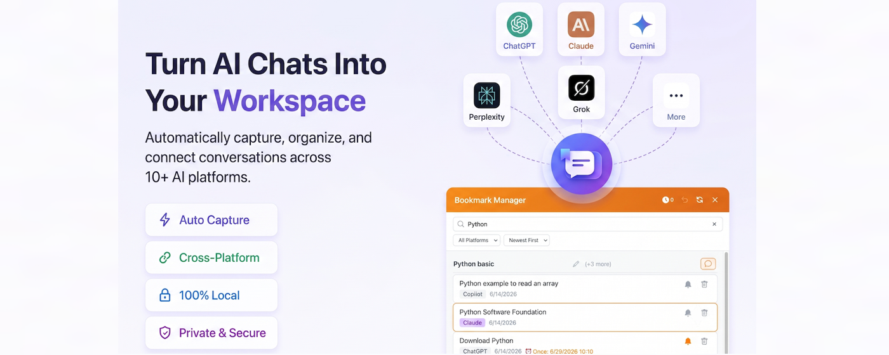
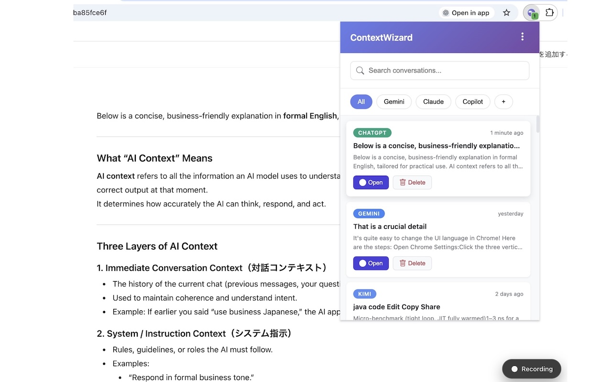
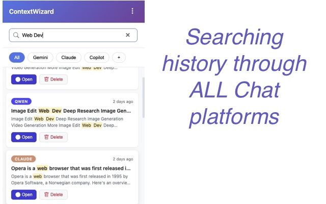
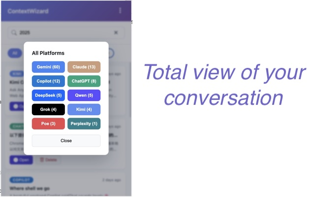
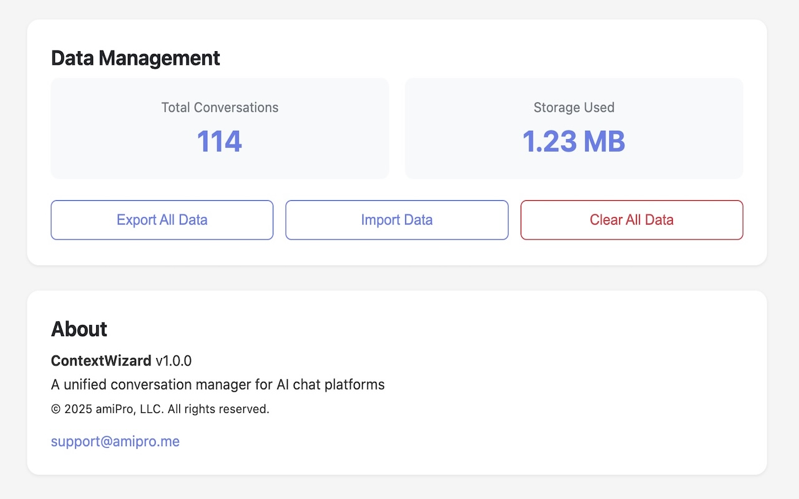
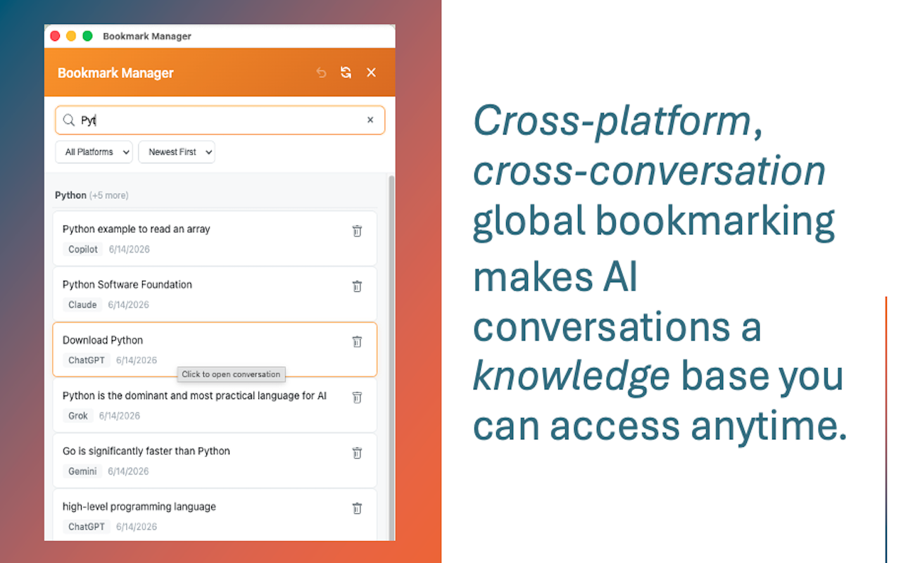

  <a href="README.md">English</a> · <a href="README-zh.md">中文</a> · <a href="README-ja.md">日本語</a>

<picture>
  <source media="(prefers-color-scheme: dark)" srcset="assets/banners/new-banner-1400.png">
  
</picture>

 

# ContextWizard — AI Workspace & Chat Search

**Your Personal Memory Layer for Every AI Assistant**

---

## 🌟 Overview

**ContextWizard** is a free, local-first browser extension that automatically captures, organizes, searches, and reconnects conversations across **ChatGPT, Claude, Gemini, Copilot, Perplexity, Grok, DeepSeek, and 10+ AI platforms** — creating one unified, searchable workspace that grows with your projects.

> **Stop losing your AI insights. ContextWizard tears down silos between platforms — your context from Claude travels with you to ChatGPT.**

| ✅ Automatic Capture | ✅ Cross-Platform Search | ✅ Bookmarks & Reminders |
|:---:|:---:|:---:|
| ✅ Context Panel v2.0 | ✅ Workspaces | ✅ 100% Local & Private |

---

## ✨ Key Features

### 📸 Automatic Capture
Conversations are saved automatically as you chat. No buttons, no manual saving. The extension detects new messages in real-time across all supported platforms using intelligent deduplication.

- **Auto mode**: Saves every conversation continuously
- **Domain filter**: Include/exclude specific platforms
- **Platform-specific adapters**: Accurate extraction for each AI service
- **Visual indicator**: Know when capture is active

### 🔍 Powerful Cross-Platform Search
Full-text search across **every captured conversation from every platform simultaneously**.

- Phrase search + keyword matching
- Smart ranking by relevance and recency
- Filter by platform, workspace, or time range
- Context previews show surrounding conversation
- Match type indicators explain why each result matched

> A single search queries ChatGPT, Claude, Gemini, and all others at once. No more platform-specific amnesia.

### 🔖 Cross-Platform Bookmarks & Groups
Save key moments across ChatGPT, Claude, and Gemini in one place. Organize bookmarks into custom groups.

- **Nested bookmark groups**: Mark the exact message, not just the conversation URL
- **Auto-generated titles**: Group titles generate from conversation content
- **Smart cleanup**: Empty groups auto-remove

### 🧠 Context Panel (v2.0)
**Bookmark Context Chat** — Your bookmarked insights no longer stay behind when you start a new conversation.

- **Floating panel** appears next to your chat input
- Select bookmarks to inject directly into any conversation
- **Smart relevance**: Shows bookmarks most relevant to your current topic
- **Session management**: Each project keeps its own context
- Keyboard navigation (Tab, arrows, Space, Enter, Escape)

### 📂 AI Workspaces
Organize conversations into project-specific workspaces.

- Drag-and-drop between workspaces
- Recent workspace auto-selects for new captures
- Workspace-level search scopes results to one project
- Group titles auto-generate from conversation content

### ⏰ Smart Reminders
Never lose a valuable insight. Set reminders on any bookmarked message.

- **Recurrence**: Once, Daily, Weekdays, Weekly, Monthly
- **Browser notifications** fire reliably even when minimized
- Click notification to jump directly to the exact bookmarked message

### ☁️ Optional Cloud Sync (Paid)
Keep workspaces and bookmarks synchronized across multiple computers.

- End-to-end encryption in transit and at rest
- Google SSO — no third-party services needed
- 7-day free trial, no credit card required

### ✏️ Prompt Editor & Privacy Guard
Manage reusable prompt templates with built-in auto-redaction.

- Create, edit, and organize prompts
- **Auto-redact** sensitive info (API keys, passwords, tokens)
- Define custom redaction rules

---

## 🖼️ Screenshots

| Main Dashboard | Search Interface | Platform Management |
|:---:|:---:|:---:|
|  |  |  |
| Overview of captured conversations | Full-text search across all platforms | Toggle platforms on/off |

| Options & Data | Bookmarks |
|:---:|:---:|
|  |  |
| Data management & settings | Cross-platform bookmark groups |

---

## 🚀 Quick Start

1. **Install** from [Chrome Web Store](https://chromewebstore.google.com/detail/contextwizard-%E2%80%93-ai-worksp/lmhnmmedgmnfggecdalkancllnekofnb) or [Edge Add-ons](https://microsoftedge.microsoft.com/addons/detail/contextwizard/nknoacgaapoeboehlgelolgbifgcimli)
2. **Click the ContextWizard icon** in your toolbar to open the dashboard
3. **Toggle platforms** you want to capture (all enabled by default)
4. **Visit any supported AI platform** — capture starts automatically
5. **Search, bookmark, and organize** your conversations

> No accounts. No API keys. No configuration files. Just install and go.

### Video Demos
- [Full Product Demo](https://youtu.be/4Mz6PAHwSuY)
- [Cross-Platform Bookmarks Demo](https://youtu.be/_XzSm3txFkg)
- [Page Context Copy Demo](https://youtu.be/lYbXXWZZMJ0)
- [Cross-Platform Thread Transfer Demo](https://youtu.be/UDKbb1h-NMA)

---

## 🛡️ Privacy & Security

**ContextWizard is built on a local-first, zero-trust architecture.**

| Property | Detail |
|----------|--------|
| **Data Storage** | All data stored locally in IndexedDB (`chrome.storage.local`) |
| **Cloud Upload** | None by default. Optional Cloud Sync only if explicitly enabled |
| **Encryption** | End-to-end encrypted when sync is used |
| **Tracking** | Zero. No analytics, no telemetry |
| **Permissions** | Manifest V3 minimum — scoped to AI platform domains only |
| **Account** | No account required for core features |

Your prompts, proprietary code, business context, and personal information remain **completely offline** by default.

> 🔒 [View full Privacy & Security documentation →](docs/privacy.md)

---

## 🔧 Supported Platforms

| Built-in | Custom |
|----------|--------|
| ChatGPT (chatgpt.com) | Any AI chat site via URL pattern |
| Claude (claude.ai) | |
| Gemini (gemini.google.com) | |
| Microsoft Copilot | |
| Perplexity (perplexity.ai) | |
| HuggingChat (huggingface.co/chat) | |
| Poe (poe.com) | |
| Grok (grok.com) | |
| DeepSeek (chat.deepseek.com) | |
| Qwen (chat.qwen.ai) | |
| Kimi (kimi.com) | |
| Manus (manus.im) | |

[📋 Full platform documentation →](docs/supported-platforms.md)

---

## 💡 Use Cases

| Role | How ContextWizard Helps |
|------|------------------------|
| **Developers** | Capture code snippets, debugging sessions, architecture discussions across multiple AI coding assistants. Search everything instantly. |
| **Writers & Marketers** | Save drafts, revisions, brainstorming sessions. Reference past work across ChatGPT and Claude without switching tabs. |
| **Researchers** | Collect literature reviews, data analysis, methodology discussions in project-specific workspaces. |
| **Students** | Organize study sessions, homework help, learning materials across subjects. Set reminders for exam review. |
| **Product Managers** | Keep competitive analysis, user research, strategy documents accessible in one place. Cross-reference across platforms. |
| **AI Power Users** | Build a persistent knowledge base from daily AI interactions — prompt experiments, model comparisons, recurring workflows. |

---

## 📊 Why ContextWizard vs Alternatives

| Capability | ContextWizard | Browser Bookmarks | Manual Notes | Platform History |
|------------|:---:|:---:|:---:|:---:|
| **Multi-platform** | ✅ 10+ platforms | ✅ (URL only) | ✅ (manual) | ❌ Siloed |
| **Full-text search** | ✅ Sub-second | ❌ URLs only | ❌ | ❌ Per-platform |
| **Message-level bookmarks** | ✅ | ❌ | ❌ | ❌ |
| **Automatic capture** | ✅ | ❌ | ❌ | ❌ |
| **Workspaces** | ✅ | ✅ (folders) | ❌ | ❌ |
| **Reminders** | ✅ | ❌ | ❌ | ❌ |
| **Context injection** | ✅ v2.0 | ❌ | ❌ | ❌ |
| **100% local & private** | ✅ | ✅ | ✅ | ❌ (cloud) |

---

## 📚 Documentation

| Resource | Link |
|----------|------|
| 📖 Documentation Home | [docs/index.md](docs/index.md) |
| 🚀 Getting Started | [docs/getting-started.md](docs/getting-started.md) |
| 🔧 Feature Guides | [docs/features/](docs/features/) |
| 📋 Supported Platforms | [docs/supported-platforms.md](docs/supported-platforms.md) |
| ❓ FAQ | [docs/FAQ.md](docs/FAQ.md) |
| 🔒 Privacy & Security | [docs/privacy.md](docs/privacy.md) |

---

## 🏗️ Technical Highlights

- **Manifest V3** Chrome extension with TypeScript codebase and esbuild bundler
- **WebAssembly-accelerated** full-text search engine for sub-second queries across thousands of conversations
- **Platform-specific content adapters** using MutationObserver and CSS selectors
- **Universal MessageExtractor fallback** for custom platforms
- **Intelligent deduplication** prevents duplicate saves on conversation revisits
- **Automated screenshot capture** generates visual thumbnails for every saved conversation
- **Debounced content saving** balances responsiveness with storage efficiency

---

## 📝 Changelog

See [CHANGELOG.md](CHANGELOG.md) for full release history.

---

## 📄 License

This repository is licensed under the Apache License 2.0 — see [LICENSE](LICENSE).

> **Note**: The ContextWizard browser extension itself is proprietary software. This repository hosts release artifacts and documentation.

---

## 🌐 Links

- [Chrome Web Store](https://chromewebstore.google.com/detail/contextwizard-%E2%80%93-ai-worksp/lmhnmmedgmnfggecdalkancllnekofnb)
- [Edge Add-ons](https://microsoftedge.microsoft.com/addons/detail/contextwizard/nknoacgaapoeboehlgelolgbifgcimli)
- [Official Website](https://amipro.me/contextwizard_top.html)
- [Privacy Policy](https://amipro.me/contextwizard_privacy_policy.html)
- [Support](mailto:support@amipro.me)

---

  Made with ❤️ by <a href="https://amipro.me">amiPro, LLC</a>

