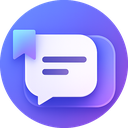
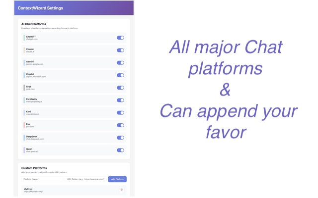

# Getting Started with ContextWizard

Installing and using ContextWizard takes less than 2 minutes. No accounts, no API keys, no configuration files.

## Step 1: Install the Extension

| Browser | Store Link |
|---------|------------|
| **Google Chrome** | [Chrome Web Store](https://chromewebstore.google.com/detail/contextwizard-%E2%80%93-ai-worksp/lmhnmmedgmnfggecdalkancllnekofnb) |
| **Microsoft Edge** | [Edge Add-ons](https://microsoftedge.microsoft.com/addons/detail/contextwizard/nknoacgaapoeboehlgelolgbifgcimli) |

Click **"Add to Browser"** / **"Get"** — the extension installs immediately.

## Step 2: Open the Dashboard

Click the ContextWizard icon in your browser toolbar:

The dashboard opens, showing your captured conversations list.

## Step 3: Configure Platforms

By default, all supported platforms are enabled. You can customize this:

1. Click the **gear icon** (⚙️) in the dashboard
2. Go to **Platforms** tab
3. Toggle each platform on/off as desired

## Step 4: Start Chatting with AI

Visit any supported AI platform:

- ChatGPT (chatgpt.com)
- Claude (claude.ai)
- Gemini (gemini.google.com)
- Any other supported platform

ContextWizard automatically detects and captures conversations as you chat.

## Step 5: Find Your Conversations

Click the ContextWizard icon to open the dashboard. You'll see:

- **All captured conversations** in reverse chronological order
- **Platform icons** showing where each conversation originated
- **Search bar** for full-text search across everything

## Features to Try Next

Now that you're set up, explore these features:

| Feature | Guide |
|---------|-------|
| 🔍 **Search across platforms** | Use the search bar in the popup |
| 🔖 **Bookmark a message** | Click the bookmark icon on any captured conversation, then select specific messages |
| 📂 **Create a workspace** | Click "New Workspace" in the dashboard, name it, and drag conversations in |
| ⏰ **Set a reminder** | Open a bookmarked conversation → click reminder icon → choose recurrence |
| 🧠 **Inject context** | On any AI platform, click the ContextWizard icon → select bookmarks to inject |
| ✏️ **Save a prompt template** | Open Prompt Editor from dashboard → create → define redaction rules |
| ☁️ **Enable Cloud Sync** | Go to Settings → Cloud Sync → Sign in with Google |

## Video Walkthroughs

- [Full Product Demo](https://youtu.be/4Mz6PAHwSuY) — See everything in action
- [Cross-Platform Bookmarks Demo](https://youtu.be/_XzSm3txFkg)
- [Page Context Copy Demo](https://youtu.be/lYbXXWZZMJ0)
- [Cross-Platform Thread Transfer Demo](https://youtu.be/UDKbb1h-NMA)
